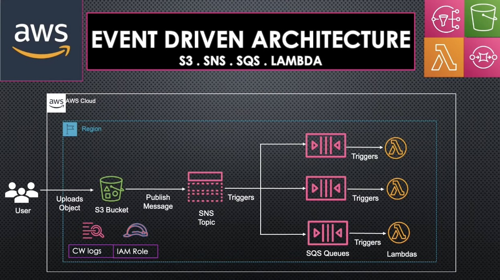

# AWS Event-Driven Architecture with S3, SNS, SQS, and Lambda

 

An event-driven serverless architecture that automatically processes uploaded files using S3, SNS, SQS, and Lambda. Files uploaded to S3 trigger filtered processing workflows through decoupled queues.

## Architecture Overview

1. **S3 Bucket**: Receives uploaded files (Producer)
2. **S3 Event Notification**: Triggers when new objects are uploaded
3. **SNS Topic**: Filters events and send to respective queue (Event Ingestion)
4. **SQS Queues**: Triggers a lambda function (Event stream)
5. **Lambda Function**: Processes the upload event (Consumer)

This repo contains SNS access policy, SQS access policy, SNS subscription filter policy and IAM lambda policies used in this implementation.

